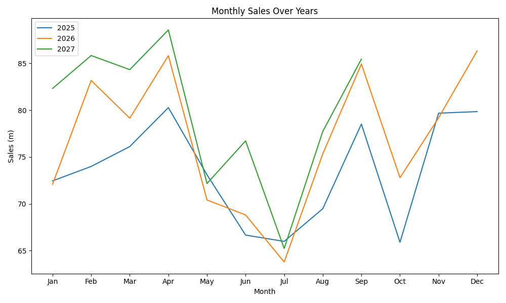
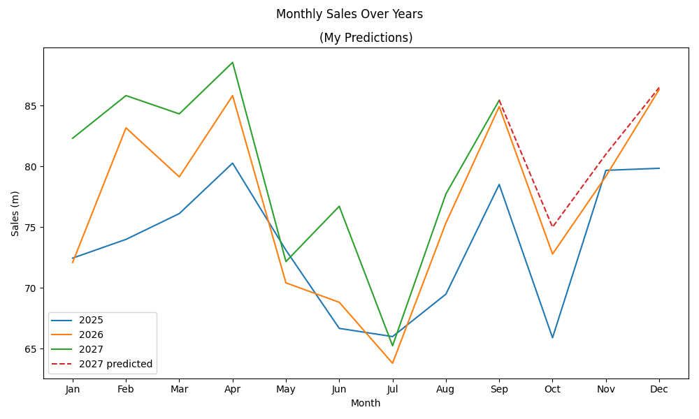
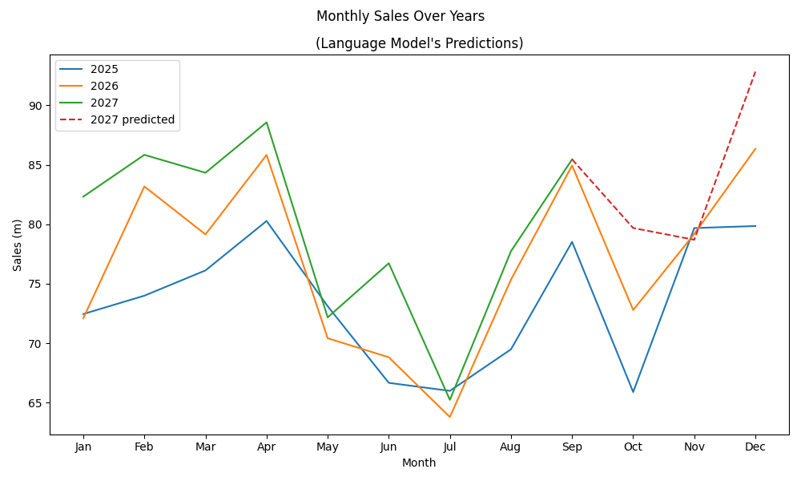

# Are You Smarter Than a Large Language Model?

I've compiled a series of tasks here which I think are of business relevance to a large number of different businesses, and which a large language model might be able to complete on it's own. Some of the tasks are very easy for a large language model, and others are tasks on which current state-of-the-art models are known to struggle. 

For each task, I show my own solution, as well as 1 or more solutions by an unsupervised large language model (I have used Open-AI's GPT4). For each task, I've also included the code which I used to generate the task (if I used code to generate any part of the task), the code which I used to prompt the language model, and any other details which I think you may find interesting.

I encourage you to solve these problems yourself, and compare your speed and aptitude to the the large language model's. For reference, the language model never took longer than 15 seconds to provide a solution (although the model's solution was not always correct). 

I hope that this gives you some insight into what large language models are capable (and incapable) of.

Here are links to specific tasks:

| Task | Description
|------|-----------------------------
| [Time Series Forecasting and Analysis](#time-series-forecasting-and-analysis-task) | Identify patterns in monthly sales data 
| [Item Triage (Fraud Detection)](#item-triage-fraud-detection-task) | Prioritize customer queries according to urgency 
| [Question Answering from a Knowledge Base](#question-answering-from-a-knowledge-base) | TODO
| [Optimisation (Knapsack problem)](#optimisation-task-knapsack-problem) | Decide which items to pack into a container in order to maximise profit 

Here are some things that I have learned through this process:

* ChatGPT3.5 produces working python code, but the code is not very readable or maintainable (poor variable naming, poor documentation etc.). Developers creating code this way without careful oversight will quickly create an unmaintainable codebase.  

* It seems impossible that OpenAI's GPT4 is doing only next token prediction. It appears to have access to self-reflection and tool use (e.g. a calculator)  

## Time Series Forecasting and Analysis Task

Inspect the following plot of monthly sales (in millions) and answer the questions which follow: 
<figure>
  
  <figcaption>(The code which generated this plot was entirely written by OpenAI's ChatGPT3.5 model)</figcaption>
</figure>
 

Please complete the following tasks:

1. Describe any predictable patterns which you observe in this data (e.g. trend).

2. Provide predictions (forecasted sales) for the last 3 months of 2027.

You can get the raw data [here](./tasks/univariate_forecasting/assets/simdata.csv).

  
Click here to see my answer

--Question 1--

* Ignoring data noise, there is clear growth in sales over time i.e. 2027 > 2026 > 2025.    

* There is clear seasonal trend within each year: TODO 

--Question 2--

I just eyeballed it, and erred on the conservative side.

* 2027-10: 75m 

* 2027-11: 81m

* 2027-12: 86.5m

<figure>
  
</figure>

 

  
Click here to see the Language Model's answer

(GPT4 took 2.02 seconds to complete this task)

Here is the full unedited model answer:

"""

1. Observations on the dataset:

   The dataset represents monthly sales data for a period of approximately three years. From a preliminary look at the data, it seems that there might be some seasonality in the sales data, as there are peaks and troughs that appear to repeat each year. 

   For instance, sales seem to increase around the start of the year (January to April), then decrease in the middle of the year (May to July), and again increase towards the end of the year (August to December). This pattern seems to repeat each year, suggesting a seasonal trend.

   Additionally, there seems to be a slight upward trend in the data over the years. For example, the sales in January 2025 were approximately 72.45m, and by January 2027, they had increased to approximately 82.32m. This suggests that sales are generally increasing over time.

2. Predictions for the last three months of 2027:

   To provide accurate predictions, a time series model such as ARIMA, SARIMA, or exponential smoothing would typically be used. These models take into account the trend and seasonality in the data to provide future forecasts. However, without the ability to run these models here, I can provide a rough estimate based on the observed patterns.

   Given the observed seasonality and trend, we might expect sales in October, November, and December of 2027 to be higher than the corresponding months in 2026. 

   If we assume a similar rate of increase as observed from 2025 to 2026, we might predict:

   - October 2027: 72.78681m (Oct 2026) + (72.78681m - 65.89159m) = 79.68103m
   - November 2027: 79.18504m (Nov 2026) + (79.18504m - 79.67798m) = 78.69210m
   - December 2027: 86.33679m (Dec 2026) + (86.33679m - 79.84679m) = 92.82679m

   Please note that these are rough estimates and actual predictions may vary. For more accurate predictions, it would be advisable to use a time series forecasting model.

"""

Here are the model's predictions visualised:

<figure>
  
</figure>

 

  
Click here to see the prompt which I gave to the language model

"

  SYSTEM: You are an insightful and educated data analyst.

USER: Please consider the following univariate time series dataset, stored in CSV format:

YearMonth,Sales (m)

2025-1,72.45048

2025-2,73.9913

...

2027-8,77.73125

2027-9,85.45101

Please can you do the following:

  1. Describe any predictable patterns which you observe in this data (e.g. trend).
        
  2. Provide predictions (forecasted sales) for the last 3 months of 2027.

"

 

  
Click here for more details about this task

Here is my python code related to this task:

* [plot_data.py](./tasks/univariate_forecasting/code/plot_data.py) (this code was 100% generated by ChatGPT3.5)

* [run_llm_analysis.py](./tasks/univariate_forecasting/code/run_llm_analysis.py)

* [simulate_data.py](./tasks/univariate_forecasting/code/simulate_data.py) 

 

## Item Triage (Fraud Detection) Task  

<figure>
  
  <figcaption>(This image was generated by the Stable Diffusion 2.1 model)</figcaption>
</figure>
 

The following table reports 40 recent customer queries to a web-based banking platform. These queries need to be prioritized according to customer security risk (i.e. most urgent are processed first). 

Please mark each customer query as "yes", "mabye" or "no", where:

| Classification | Meaning 
|----------------|----------
| Yes            | The customer has almost certainly lost money as a result of fraudulent transactions
| Maybe          | There is a possibility that the customer has lost money as a result of fraudulent transactions 
| No             | The customer has almost certainly not lost any money due to fraud

  
Click here to see all of the customer queries

| Query ID | Query 
|----------|-------
| 0        | I am noticing an unexpected increase in payments to my utility service provider. Can you help?
| 1        | I authorized a debit order but didn't expect my funds to go out. Can customer support assist me in understanding this?
| 2        | How do I link my saving and checking accounts on your web application?
| 3        | I'd like to ensure that I have fraud protection on my account. Can you assist?
| 4        | Can you please clarify the steps followed to report potential fraud in my account?
| 5        | Can you please explain how your institution handles fraud detection and prevention?
| 6        | I cannot locate my credit card statement in your online banking platform. Need assistance.
| 7        | I've seen several payments to an online retailer whom I've never shopped from. Can you please assist me in addressing this issue?
| 8        | Help needed! Money came out of my account labeled as 'debit order.' Can you explain what this is?
| 9        | Can you please explain why money has been deducted from my account without my knowledge? I remember authorizing a 'debit order' but I didn't know what it was.
| 10       | I authorized a debit order, but wasn't expecting funds to be deducted from my account. Can you explain why this happened?
| 11       | Hey, there's a transaction made when I was travelling, and I know I didn't make it. Would you mind checking?
| 12       | How do I create a new payee when making online transactions on your website?
| 13       | What course of action should I take if I suspect fraud on my account?
| 14       | Hi, I've recently noticed several unauthorized transactions on my account. Could you help me investigate?
| 15       | I received an email asking for my account details. Is this a typical case of email fraud?
| 16       | What measures does the bank take to warn customers about potential fraud risks?
| 17       | Do you have any educational resources about fraud prevention that I can review?
| 18       | Can you guide me through setting up automatic bill payments on your website?
| 19       | How do I set up fraud alerts to my phone and email?
| 20       | I am unable to locate the 'transfer funds' option on your online banking platform.
| 21       | I noticed a debit order on my account that I don't understand. What happens when you authorize a debit order?
| 22       | I think I'm a victim of fraud. Can you help me secure my account?
| 23       | If someone tried to commit fraud involving my account, how would I be notified?
| 24       | I have received an alert for a cash transfer I did not authorize. Can you help me cancel this transaction?
| 25       | Could you explain the steps for updating my contact details in your banking application?
| 26       | Help! My account shows a payment that exceeds my set transfer limit, but I did not authorize it.
| 27       | I authorized a debit order but I don't really understand what that means. Can you please explain and tell me why my money was taken out?
| 28       | I am having trouble finding the option to set up mobile alerts. Could you assist?
| 29       | Hey, there's a large payment made to a vendor I've never done business with. What's going on?
| 30       | Can you guide me through ordering a new checkbook via your web application?
| 31       | Can you clarify how a debit order works? I authorized it and money has been taken out of my account unexpectedly.
| 32       | I spotted a suspicious foreign transaction on my account. Could you check it out, please?
| 33       | I don't understand the concept of a debit order and I'm seeing deductions on my account. Could you please explain this to me?
| 34       | I can't seem to find where to check my account balance. Could you help?
| 35       | I saw a transaction on my account that I don't recognize. Turns out I'd authorized a debit order. Can you explain what this debit order is?
| 36       | I'm unable to recognize a recurring monthly payment on my account. Can you assist with this?
| 37       | How do I reset my pin using your banking website? I can't find the option.
| 38       | Money deducted under 'debit order' and I don't understand what that means - could you kindly explain?
| 39       | Hello, I observed multiple small payments to the same recipient. Is this a fraudulent activity?

 

  
Click here to see the Language Model's answers

| Query ID | Query | Customer has been a victim of fraud (high likelihood)
|----------|-------|------------------
| 0 | I am noticing an unexpected increase in payments to my utility service provider. Can you help? | Maybe
| 1 | I authorized a debit order but didn't expect my funds to go out. Can customer support assist me in understanding this? | No
| 2 | How do I link my saving and checking accounts on your web application? | No
| 3 | I'd like to ensure that I have fraud protection on my account. Can you assist? | No
| 4 | Can you please clarify the steps followed to report potential fraud in my account? | Maybe
| 5 | Can you please explain how your institution handles fraud detection and prevention? | No
| 6 | I cannot locate my credit card statement in your online banking platform. Need assistance. | No
| 7 | I've seen several payments to an online retailer whom I've never shopped from. Can you please assist me in addressing this issue? | Yes
| 8 | Help needed! Money came out of my account labeled as 'debit order.' Can you explain what this is? | Maybe
| 9 | Can you please explain why money has been deducted from my account without my knowledge? I remember authorizing a 'debit order' but I didn't know what it was. | Maybe
| 10 | I authorized a debit order, but wasn't expecting funds to be deducted from my account. Can you explain why this happened? | Maybe
| 11 | Hey, there's a transaction made when I was travelling, and I know I didn't make it. Would you mind checking? | Yes
| 12 | How do I create a new payee when making online transactions on your website? | No
| 13 | What course of action should I take if I suspect fraud on my account? | Maybe
| 14 | Hi, I've recently noticed several unauthorized transactions on my account. Could you help me investigate? | Yes
| 15 | I received an email asking for my account details. Is this a typical case of email fraud? | Maybe
| 16 | What measures does the bank take to warn customers about potential fraud risks? | No
| 17 | Do you have any educational resources about fraud prevention that I can review? | No
| 18 | Can you guide me through setting up automatic bill payments on your website? | No
| 19 | How do I set up fraud alerts to my phone and email? | No
| 20 | I am unable to locate the 'transfer funds' option on your online banking platform. | No
| 21 | I noticed a debit order on my account that I don't understand. What happens when you authorize a debit order? | Maybe
| 22 | I think I'm a victim of fraud. Can you help me secure my account? | Yes
| 23 | If someone tried to commit fraud involving my account, how would I be notified? | No
| 24 | I have received an alert for a cash transfer I did not authorize. Can you help me cancel this transaction? | Yes
| 25 | Could you explain the steps for updating my contact details in your banking application? | No
| 26 | Help! My account shows a payment that exceeds my set transfer limit, but I did not authorize it. | Yes
| 27 | I authorized a debit order but I don't really understand what that means. Can you please explain and tell me why my money was taken out? | Maybe
| 28 | I am having trouble finding the option to set up mobile alerts. Could you assist? | No
| 29 | Hey, there's a large payment made to a vendor I've never done business with. What's going on? | Yes
| 30 | Can you guide me through ordering a new checkbook via your web application? | No
| 31 | Can you clarify how a debit order works? I authorized it and money has been taken out of my account unexpectedly. | No
| 32 | I spotted a suspicious foreign transaction on my account. Could you check it out, please? | Yes
| 33 | I don't understand the concept of a debit order and I'm seeing deductions on my account. Could you please explain this to me? | Maybe
| 34 | I can't seem to find where to check my account balance. Could you help? | No
| 35 | I saw a transaction on my account that I don't recognize. Turns out I'd authorized a debit order. Can you explain what this debit order is? | Maybe
| 36 | I'm unable to recognize a recurring monthly payment on my account. Can you assist with this? | Maybe
| 37 | How do I reset my pin using your banking website? I can't find the option. | No
| 38 | Money deducted under 'debit order' and I don't understand what that means - could you kindly explain? | Maybe
| 39 | Hello, I observed multiple small payments to the same recipient. Is this a fraudulent activity? | Maybe

 

  
Click here to see the prompt which I gave to the language model

The model was prompted separately for each individual customer query. Each time, it was given the same context and the same single example as follows:

"  
SYSTEM: You are an experienced cybersecurity professional working for a large bank. You have been assigned the task of classifying a set of customer queries which have been submitted directly by customers on your web-based banking platform. When presented with a user query, please answer with only a single word: 'Yes', 'No' or 'Maybe'. Please do not provide any additional information. 

USER: Thank you so much for resolving my fraud case so quickly!

ASSISTANT: No.

USER: &lt;new customer query goes here&gt;

"

You can view the python code which I used to get responses from the model [here](./tasks/item_triage/code/classify_customer_queries.py)

 

  
Click here for more details about this task

I generated all of the customer queries in this task themselves using the OpenAi GPT4 model (they appear in this task unedited), with the following prompt:
  

*"Please generate 10 authentic customer queries that were submitted to the 'customer support' service of a web-based banking application. Each query should be between 5 and 50 words long. The customer queries must all be related to {topic}."*

I ran this prompt separately for each of these topics:

* {payments with suspicious attributes}
* {difficulty with the user interface (they don't know how to use the platform)}
* {absolutely normal banking activity (i.e. nothing fraudulent), but containing the word 'fraud'}

You can see my python customer query simulation code [here](./tasks/item_triage/code/simulate_customer_queries.py)

 

## Question Answering from a Knowledge Base

<figure>
  
  <figcaption>(This image was generated by the Stable Diffusion 2.1 model)</figcaption>
</figure>
 

Using [this knowledge base](./tasks/knowledge_base_question_answering/assets/knowledge_base.txt), answer the following customer questions, quoting the portion of the knowledge base which answered the question:

  
Click here to see my answer

  TODO

 

  
Click here to see the Language Model's answer

    TODO

 

  
Click here to see the prompt which I gave to the language model

    TODO

 

## Optimisation Task (Knapsack problem)

Please decide which of the following facilities should be built, in order to maximise total output:

| FacilityID | Resource Usage   | Output     |
|------------|------------------|------------|
| 1          | 2                | 30         |
| 2          | 4                | 10         |
| 3          | 6                | 50         |
| 4          | 8                | 10         |
| 5          | 10               | 60         |
| 6          | 12               | 20         |
| 7          | 14               | 80         |
| 8          | 18               | 50         |

Constraints:

* Total resource usage (sum across all facilities) cannot exceed 30.

* No more than 1 of each facility may be built 

  
Click here to see my answer

I evaluated candidate solutions {1,2,3,4,5}, {1,3,5,6} and {3,5,7}, from which the best was {3,5,7} (with a total value of 190).

I confirmed that this is the correct solution using google's [ortools](https://github.com/google/or-tools) (see my python code [here](./tasks/knapsack_problem/code/explicit_solution.py))

 

  
Click here to see the Language Model's answer

    TODO

 

  
Click here to see the prompt which I gave to the language model

    TODO

 

  
Click here for more details about this task

The facility attributes were generated by ChatGPT3.5 using the following prompt: "Can you please generate an example knapsack problem for me please? One in there is one knapsack and 8 possible items to pack."

In case the generated problem was very similar to an example appearing in ChatGPT3.5's training data (which might give a GPT model an unfair advantage in answering the question), after getting the model's response I changed the order of rows and columns in the table, renamed the columns, divided each facility output by 3 and doubled each facility resource usage.

 

# MY TEMP NOTES

What LLMs are good for in a business context:
* Personalized marketing (a marketing message unique to a single customer)
* Question-answering chatbot (or just question answering)
* Content creation (blog posts, social media posts etc., article title)
* Provide feedback on text (e.g. find spelling errors, comment on style etc.)
* Data analysis. Generate insights from data.
* Assisting customers (with e.g. a checkout journey) by referencing the docs
* Fraud detection
* Analyse financial reports
* Document question-answering
* Summarise text (e.g. a news article)
* Document drafting (e.g. a legal contract)
* Generate personalized recommendations
* Screening resumes
* Trend forecasting
* Answering customer queries from a large knowledge base
* Booking appointments
* Providing product information
* Sentiment Analysis
* Predictive analytics 
* Double-checking human decisions (or providing suggestions) e.g. medical diagnosis
* Tracking and analysing customer feedback
* Structured data extraction
* Querying structured data (e.g. how is my marketing campaign going?)
* Data sifting (e.g. select all articles relating to X)
* Simulating data

Other things LLMs are good at:
* 

What LLMs are bad at:
*
